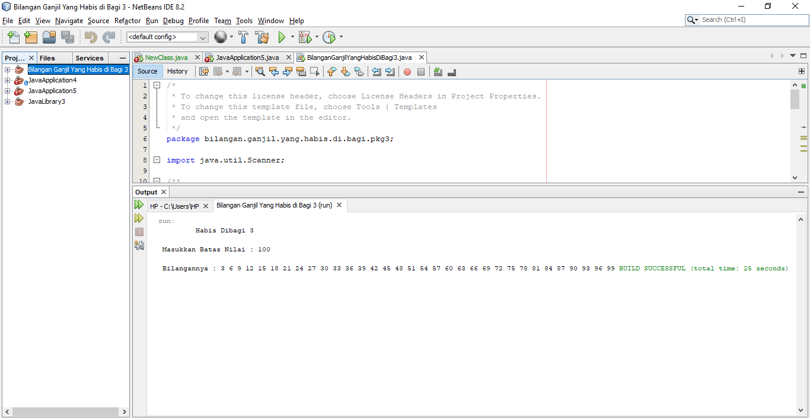

#   Nama    = Midun Hakiki
#   NIM     = 312210583
#   Kelas   = TI.22.B1

# package bilangan ganjil yang habis dibagi 3

import java.util.Scanner;

    public class BilanganGanjilYangHabisDiBagi3 {

        public static void main(String[] args) {
        
            Scanner userInput = new Scanner(System.in);
            int y;
            System.out.print("\t Habis Dibagi 3\n");
        
            System.out.print("\n Masukkan Batas Nilai : ");
            y = userInput.nextInt();
        
            System.out.print("\n Bilangannya : ");
            for (int i = 2; i <= y; i++){
                if (i % 3 == 0){
                    System.out.print(i + " ");
    
                }
            }
        }
    }

- Hasil dari run

# TERIMAKASIH...